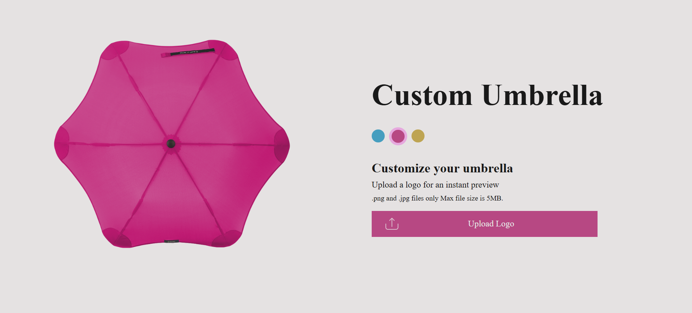
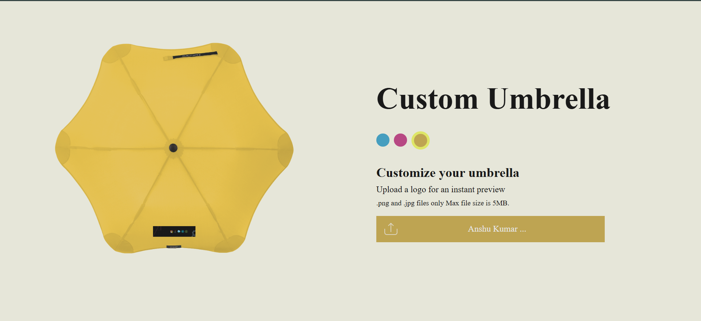

## **Structure of this project**
This is purely done using **HTML, CSS and javascript** in this we can add a logo on the umbrella's bottom it has responsive ui and dynamic value updates.

---

## **HTML : document structure**
    
1. The layout consists of 2 section left and right.

2. On larger screens, the layout uses flex-row.

3. On smaller screens, it uses flex-column.

---

## **CSS : has 3 sections** 
    
1. Class based styling; styles are applied on the basis of class name provided {explicit classes}.

2. Animations : Includes animations like - loading spinner (loader_icon.svg) & Fade-in Effect for umbrella image.

3. Created generic reusable classes for colors (use anywhere anytime) :D.

---

## **SCRIPT(js) : has all the dynamic logic** 
    
1. Starting from finding all the targeted dynamic values via "id".

2. Flags to manage states such as: active color (flag name : currentColor), loading (flag name : isLoading), uploaded (flag name : isUploaded)
    
3. Color selection and umbrella update : according to the selected color the umbrella is updated with background color, upload button and loader svg color.
    
4. Loading function : displays a loader whenever a event is triggered ... 
    
5. File upload logic : Validates file type (.png and .jpg) and size must be below 5MB. It shows alert if validation fails and if it succeeds then the upload flag is set as true triggering loading screen and updating umbrella. 

## **Screenshots**
## Pink color | NOTE - default is blue

---
## Spinning loader

---
## Umbrella with logo
